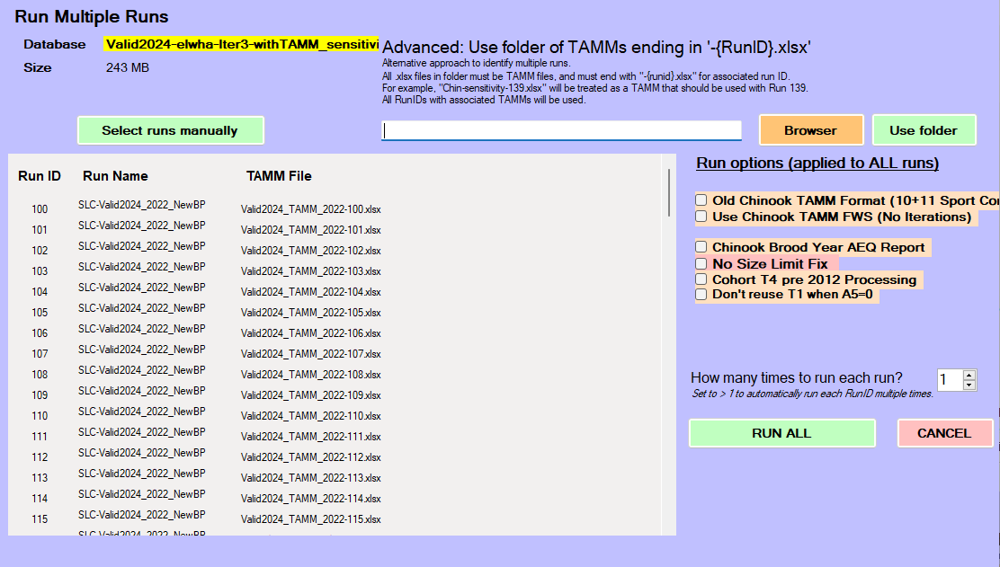

# sensitivity_analyses

We recently developed a fork for FRAM that allows batch running of FRAM
runs (<https://github.com/FRAMverse/FRAM_automation>). This can
facilitate sensitivity analyses, where we explore the consequences to
fishery mortalities or ERs of changes in some key input or inputs of
interest. Here we provide a tutorial for recently added functionality to
`framrsquared` that can be used to generate runs for sensitivity
analyses which can then be batch-run in this new FRAM fork.

## Overview

I begin by describing the fundamental framework underlying the
sensitivity anlaysis functions, then walk through those functions
themselves, and end with an example of using these functions to run a
sensitivity analysis on Elwha for our new OOB work.

## Philosophy and functions

### Match/Replace dataframe approach

Fundamentally, any sort of changes to the FRAM database – including for
a sensitivity analyses – need to identify

1.  What should be changed, and
2.  What new values should be used

&nbsp;

1.  requires both identify the table (e.g. maybe the StockRecruit
    table), the columns to change (e.g., maybe RecruitScaleFactor), and
    rows to change (maybe all rows with StockID 17 or 18, or all rows
    with Age 2, or some mixing and maxing of conditions).

The philosophy I took in writing the
[`modify_table()`](https://framverse.github.io/framrsquared/reference/modify_table.md)
and `sensitivity_*()` functions was to identify both (1) and (2) in a
systematic, flexible way. All sensitivity analyses functions rely on
[`modify_table()`](https://framverse.github.io/framrsquared/reference/modify_table.md)
under the hood; even though it is unlikely that we will use
[`modify_table()`](https://framverse.github.io/framrsquared/reference/modify_table.md)
directly, it is important to understand the structure of its input.
[`modify_table()`](https://framverse.github.io/framrsquared/reference/modify_table.md)
answers both (1) and (2) above using a “match/replace” dataframe. Each
column name must start with a prefix of “match\_” or “replace\_”, and
the rest of the column name should be the name of a column in the FRAM
database column (with exact match of capitalization). Any column label
that starts with “match\_” will be used to identify rows to change, and
any column label that starts with “replace\_” provides values that
should be used. This is somewhat analogous to a `join()` framework, in
that we have “match by” columns (in a join, we would use these for the
`by =` argument), and other columns that are not used for match. The
primary difference from a join framework is that rather than adding new
columns to a dataframe, we are replacing values in place.

As an example, if we were asked to look at the consequences of changing
the size limits for fishery

For example, if we wanted to change the size limits for Chinook in Area
7 sport (Fishery ID 36). Currently those are 520 for each time step, but
let’s imagine the request was to see what happens if we increased the
size limit to 600 in timestep 1, left the size limit at 520 in timestep
2, and decreased the size limit to 450 in timestep 3. Timestep 4 should
match timestep 1, so should also be 600. Let’s say we’re supposed to
test the effects on the last three years’ final preseason runs, which
have run ids 28, 29, and 30. For reference, the size limits are
specified in the MinimumSize column of the SizeLimits table.

We could specify those changes with the following match/replace
dataframe

``` r
## make the match/replace dataframe for a single run
mr_df = data.frame(match_FisheryID = c(36, 36, 36), 
                   match_TimeStep = c(1,3,4),
                   replace_MinimumSize = c(600, 450, 600)
                   )
```

Before worrying about the run ids, our match/replace dataframe looks
like this:

``` r
mr_df
```

    ##   match_FisheryID match_TimeStep replace_MinimumSize
    ## 1              36              1                 600
    ## 2              36              3                 450
    ## 3              36              4                 600

If we used this as it is, as in
`modify_table(fram_db, "SizeLimits", mr_df)`,
[`modify_table()`](https://framverse.github.io/framrsquared/reference/modify_table.md)
would find all entries with fishery 36 timestep 1 or 4 and replace the
MinimumSize with 600. Similarly, i twould find all entries with fishery
36 timestep 3 and replace the MinimumSize with 450. We can constrain
these changes to run ids 28 through 30 by adding a `match_RunID` column

``` r
mr_df = tidyr::expand_grid(match_RunID = 28:30, mr_df)
mr_df
```

    ## # A tibble: 9 × 4
    ##   match_RunID match_FisheryID match_TimeStep replace_MinimumSize
    ##         <int>           <dbl>          <dbl>               <dbl>
    ## 1          28              36              1                 600
    ## 2          28              36              3                 450
    ## 3          28              36              4                 600
    ## 4          29              36              1                 600
    ## 5          29              36              3                 450
    ## 6          29              36              4                 600
    ## 7          30              36              1                 600
    ## 8          30              36              3                 450
    ## 9          30              36              4                 600

This framework allows us to specify any number of changes (to a single
table), with any kind of simple matching criterion. Further, it’s easy
to review the changes specified, and the changes can easily be saved to
a csv or excel file for later review.

### Scaling

We may not always want to specify our new values in absolute terms,
especially if we’re looking at the joint effects of changing several
values. The `calc_from_scaling()` allows the specification of changes
*relative to current values*, and returns the corresponding
match/replace table. For example, this allows us to implement scenarios
like “What if catch in these ten fisheries were 50% of what we thought
it was? What if it was 150% of what we thought it was?.
`calc_from_scaling()` takes the scenario using modified version of the
match/replace dataframe (with prefix”scale\_” instead of “replace\_”),
and runs the calculations to find what the actual replacement values
should be, then returns a match/replace dataframe that can be fed into
[`modify_table()`](https://framverse.github.io/framrsquared/reference/modify_table.md).
This is the framework behind
[`sensitivity_scaled()`](https://framverse.github.io/framrsquared/reference/sensitivity_scaled.md).

### sensitivity\_\*() functions

As of writing, there are three functions designed to generate
sensitivity analyses

- [`sensitivity_exact()`](https://framverse.github.io/framrsquared/reference/sensitivity_exact.md)
  takes a sequence of exact values to be used in the sensitivity
  analyses. Useful for cases when we, for example, want to look at what
  happens if a recruit scaler varies between 0.1 and 10.
- [`sensitivity_scaled()`](https://framverse.github.io/framrsquared/reference/sensitivity_scaled.md)
  takes a sequence of scaling values. Useful if we want to look at
  concurrent changes for subsets of stocks or fisheries in a way that is
  consistent with an existing run; e.g. “what would have happened last
  year if all coastal stocks were 10%, 20%, …, 200% of the values used
  in the post-season run?
- [`sensitivity_custom()`](https://framverse.github.io/framrsquared/reference/sensitivity_custom.md)
  takes a list of match/replace dataframes. This is harder to use, but
  supports more complex changes like those needed to explore how changes
  in age composition affect ERs. I would recommend writing additional
  functions to programmatically generate those lists.

Each of these functions starts with a template run in the FRAM database,
makes as many copies as necessary of that template run, makes changes to
each run so that they represent the spectrum of values needed for the
sensitivity analysis, and optionally copies a TAMM run into a directory
with appropriate naming so that the folder can be used to load the runs
and tamms into the FRAM multirun fork. By default these functions also
save the changes made and associated run ids into a log file in the same
directory as the FRAM database.

#### Common sensitivity functions

[`sensitivity_exact()`](https://framverse.github.io/framrsquared/reference/sensitivity_exact.md)
and
[`sensitivity_scaled()`](https://framverse.github.io/framrsquared/reference/sensitivity_scaled.md)
have similar arguments, most of them exactly the same. For simplicity, I
will not describe them all here; instead, see their respective help
pages. Each of these only allows specification a single new value
(either an exact value or a scaling factor) for each sensitivity run,
although it can be applied to multiple columns and rows of a table. For
example, it is possible to use
[`sensitivity_exact()`](https://framverse.github.io/framrsquared/reference/sensitivity_exact.md)
to have the recruit scalers of a dozen stocks be 0.1 in the first run,
0.2 in the second run, 0.3 in the third run, etc. For something in which
multiple values need to be changed but not in concert, use
[`sensitivity_custom()`](https://framverse.github.io/framrsquared/reference/sensitivity_custom.md).
(For complex scenarios in which multiple values should be changing
differently from one another but proportionally to some starting ratio,
it may be possible to do so by first modifying the values of the
template run to the desired ratio and then using
[`sensitivity_scaled()`](https://framverse.github.io/framrsquared/reference/sensitivity_scaled.md)).

When designing a sensitivity analysis, we need to first decide:

- what is our starting run? This determines `template_run`.
- What do we want to be changing across these runs? This determines
  `table_name` and `match_df`.
- What sequence of values do we want to look at? This determines
  `scale_values` or `exact_values`. Several notes here. First, because
  we provide a vector of values, we can choose to a linear scale (e.g.,
  `seq(0.1, 2, by = 0.1)`), OR we can choose a more complex scale like a
  log scale(e.g., `exp(seq(log(10), log(100000), length = 50)))`.
  Second, the length of the sequence of values we provide determines how
  many runs are generated. In general it looks like we need to keep the
  number of runs in FRAM access databases to no more than 500, so bear
  that in mind when making sensitivity analyses. If there is a need for
  many more runs in a single database, consider updating the FRAM fork
  to fold in the SQLite support Ty wrote, and then modify these
  functions to work with SQLite as well.
- Do we want to use TAMMs with our sensitivity runs? If so, what TAMM
  file do we want to be our template? Where do we want the sensitivity
  run TAMMs to be saved? Using TAMM runs will slow the actual
  sensitivity analyses run in FRAM, but are necessary to do things like
  account for coastal iterations (Coho) or do a bunch of important
  things (Chinook).

#### Handling complicated things

[`sensitivity_custom()`](https://framverse.github.io/framrsquared/reference/sensitivity_custom.md)
allows the specification of arbitrary scenarios for each sensitivity
run; the only constraint is that (currently) only one table can be
changed for each sensitivity run. If, in the future, we end up with
frequent changes that must be simultaneously specified across multiple
tables, it may be useful to change `sensitivity_custom` to optionally
take a more complex structure. Effectively we would want a list of lists
for `scenario_list`, but it would be safest if the “inner” list
(multiple match/replace tables to be applied to a single run) were
written as some kind of custom class / object-type so that there is less
space for mistakes.

We may sometimes want our sensitivity analysis to look at the effects of
changing the TAMM rather than values directly in FRAM. While there is no
direct method to do so, we can use
[`sensitivity_scaled()`](https://framverse.github.io/framrsquared/reference/sensitivity_scaled.md)
as a quick way to create a series of identical runs and associated TAMMs
by providing `scale_values = rep(1, nrun)` where `nrun` is the number of
desired runs. We can then write code to programmatically change the
values in each TAMM. If this is a frequent occurrence, we might write
functions here or in {TAMMsupport} to handle the TAMM modifications.

## Example

As part of the Elwha Out of Base (OOB) work in 2025, I wanted to look at
how changes to the Elwha starting abundances affect ERs across the
board. I started by making a copy of the Elwa OOB “valid run” database
to ensure I had no way of accidentally screwing up the reference
database.

With the new database ready for modification, I decided:

- That I would use the latest postseason run as my starting point. This
  had run ID 62 in the database.
- That I would use TAMMs for each run. I found the TAMM corresponding to
  the latest postseason run, which happened to be in the main folder of
  the working directory, titled “Valid2024_TAMM_2022.xlsx”. I decided my
  sensitivity analysis TAMMs should live in the folder
  “elwha-scaling-sensitivity”.
- That I would vary abundance relative to the template run rather than
  assigning StockRecruit numbers based on exact values. Using relative
  values is convenient when we want to change multiple values at once.
  In this case, I wanted to vary the stock recruit scalers for every age
  class.

Using framrosetta, I found that Elwha is part of FRAM stocks 35 and 36
(unmarked and marked stocks). Looking at the StockRecruit table, I found
that I wanted I wanted the changes to be applied to all rows in which
StockID was 35 or 36, and I needed the changes to be made to column
“RecruitScaleFactor”. I decided to also have the proportional changes be
applied to “RecruitCohortSize” so that they remained aligned with the
scale factors. This choice is not important for the use of framrsquared,
and instead is addressing a funky quirk of FRAM itself.

(FRAM only *uses* RecruitScaleFactor, while RecruitCohortSize is present
as any reference point (otherwise to get that number by multiplying the
base cohort size by the RecruitScaleFactor term). However, at present
FRAM only calculates RecruitCohortSize when making changes to the
recruit scalers in the FRAM interface, so if we make changes to the
RecruitScaleFactor values directly in the database, RecruitCohortSize
will continue to show old values, making it meaningless. This isn’t a
huge deal since it doesn’t get used anywhere, but it can be misleading
to anyone looking at the database, so it’s good practice to try to keep
them aligned.)

I decided I want to look at abundances from 5% of the template run to
2,000% (e.g., x0.05 through x20 abundances). I could do this on a linear
scale, but it seemed more important to have more sensitivity runs in the
5%-100% range, somewhat fewer in the 100%-1000% range, and fewer still
in the 1000%-2000% range. We could achieve something similar by sampling
evenly on a log scale, but it’s easy enough to just space our samples on
piecewise linear scales:

``` r
scale_terms = c(seq(0.05, 1, by = 0.05), seq(1, 10, by = 0.1), seq(10, 20, by = 0.5))
```

With all that in mind, creating the sensitivity analyses required very
little work.

``` r
library(here)
library(framrsquared)

fram_db <- connect_fram_db(here("Valid2024-elwha-Iter3-withTAMM_sensitivity.mdb"))

fram_db |> 
  sensitivity_scaled(template_run = 62, 
                     table_name = "StockRecruit",
                      match_df = data.frame(StockID = c(35, 36)),
                     scale_values = scale_terms,
                     cols_to_vary = c("RecruitScaleFactor", "RecruitCohortSize"),
                     tamm_template = here("post-season-withOOB/Valid2024_TAMM_2022.xlsx"),
                     tamm_target_folder = here("elwha-scaling-sensitivity"),
                     label = "elwha-sensitivity")

disconnect_fram_db(fram_db)
```

That is all that is necessary to create 132 sensitivity analyses runs
that are ready to run with the FRAM fork. We can even automate loading
them in by opening a file explorer window and navigating to the folder
with the tamm files (“elwha-scaling-sensitivity”) and copying the folder
path into the “Advanced:..” field and clicking “Use folder”


At this point, FRAM will be ready to hit the Run All button:



The key pieces in the code call above that may not be intuitive:

- `match_df` is a dataframe with named columns that match the names of
  columns in the FRAM database. Here we only have one column, but if we
  wanted our changes to only apply to some age classes, for example, we
  would need a second column called “Age” that had the age classes we
  wanted to change.
- `cols_to_vary` is a vector of character strings that identify the
  columns of the table that should be varied.
